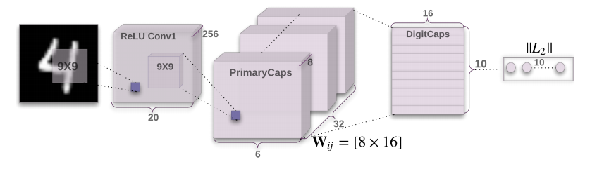

# CapsNet
  This is a CapsNet repo which is a tenserflow version for Dynamic Routing Between Capsules(Geoffrey E. Hinton et al)

## Framework
  - Picture below shows the framework of CapsNet, more details can be seen in this repo.
  
  

  
  - Picture below shows the reconstruction processing, more details can be seen in this repo. 
  
  

  
## Routing
  Picture below shows how routing work, more details can be seen in this repo.
  
  

  
# Requirement
  
  tensorflow 1.3.0
  
  python 2.7.12
  
  numpy 1.13.1
  
  scipy 0.17.0
  
# Usage
  (1)download this repo to your own directory
  
    $ git clone https://github.com/nnUyi/CapsNet.git
    
  (2)download mnist dataset and store it in the data directory(directory named data)
  
  (3)training
  
    $ python main.py --is_training=True --mask_with_y=True
    
  (4)testing
  
    $ python main.py --is_training=False --mask_with_y=False

# Experiments
  The result shows below, after 15 epoches, we can clearly obtain such a good experimental result.
  
  

# Reference

  This repo is finished by referring to [naturomics-CapsNet-Tensorflow](https://github.com/naturomics/CapsNet-Tensorflow/issues)
  
# Other Implements
  - [Tensorflow](https://github.com/naturomics/CapsNet-Tensorflow/issues)
  - [Pytorch](https://github.com/gram-ai/capsule-networks)
  - [Keras](https://github.com/XifengGuo/CapsNet-Keras)

# Contacts
  
  Email:computerscienceyyz@163.com, Thank you for contacting if you find something wrong or if you have some problems!!!
